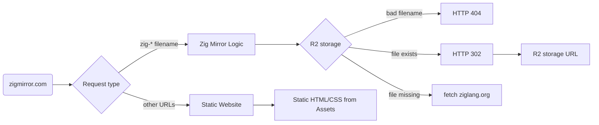

# zigmirror.com

A community mirror to download the [Zig](https://ziglang.org) programming language binaries.

---

### Architecture

This mirror is based on Cloudflare.
It uses Workers, R2, and static assets to host both a website and download links for all the available Zig binary artifacts.

### Replicate this setup

Needed:

* a registered domain
* a Cloudflare account

Steps:

1. Create a site in Cloudflare console
2. Register the Cloudflare nameservers in the domain's registrar settings
3. Configure an R2 bucket <MYBYUCKET>
4. Clone this repository
5. Install [`wrangler`](https://developers.cloudflare.com/workers/wrangler/install-and-update/)

       npm i -D wrangler@latest
       wrangler login

6. Install the dependencies

       npm i; npm run cf-typegen

7. Enable bucket public access in the R2 console, in Settings > Custom domains > Public Development URL

8. Modify `wrangler.jsonc` with the name of the bucket (<MYBUCKET>) and the R2 URL (`BUCKET_PUBLIC_URL`)

9. Add your static website assets to the `public/` directory (HTML, CSS, etc.)

10. Deploy the worker

       npx wrangler deploy

11. Fetch the worker public URL

12. Configure the DNS for the domain using the root address (`@`), type CNAME, setting the Name with the worker URL from previous step

### Costs

On a free Cloudflare plan, the costs are only accounted for the R2 storage and API calls and Workers usage.
Refer to [R2 pricing](https://developers.cloudflare.com/r2/pricing/#r2-pricing) and [Workers pricing](https://developers.cloudflare.com/workers/platform/pricing/#workers) for a complete detail.

As an example, storing in R2 _all_ tarballs of Zig takes ~13GB at the time of writing.
With a 1 Million download requests served by Workers, both workers and R2 api calls fall into the free tier.
R2 storage has a 10 GB-month free tier, so the cost to host 13 GB-month is 0.55 $/month.
